# My To-Do App

## Project Overview

**What is it:**  
A to-do app.

**Purpose:**  
Technical test for Ludex Labs.

**Features:**  
- Create, Read, Update, and Delete tasks using local storage  
- Drag and drop support  
- Dark & Light theme  
- Filtering and search  
- Error handling  
- Mobile responsiveness

## Technologies Used
- **React TypeScript**  
- **GSAP** for animations  
- **Swapy** for drag and drop functionality  
- **Prettier** for formatting  
- **ESLint** for code quality

## How I Built It
1. Created Figma mockups.  
2. Structured the project to identify the needed components.  
3. Coded a static version of the website.  
4. Implemented persistence with local storage and full CRUD operations.  
5. Experimented with drag and drop in a separate branch, then merged the feature into main.  
6. Documented, formatted, and improved code quality using comments, Prettier, and ESLint.  
7. Fixed bugs.  
8. Documentation.

## Previews


### Dark and light mode
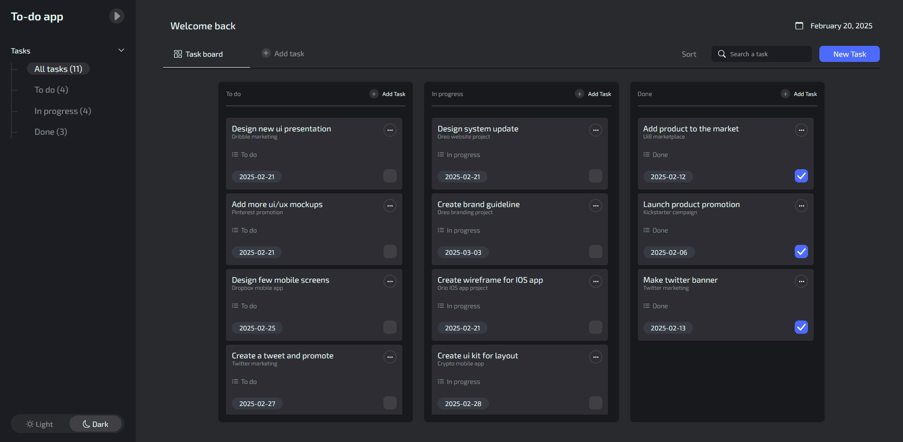
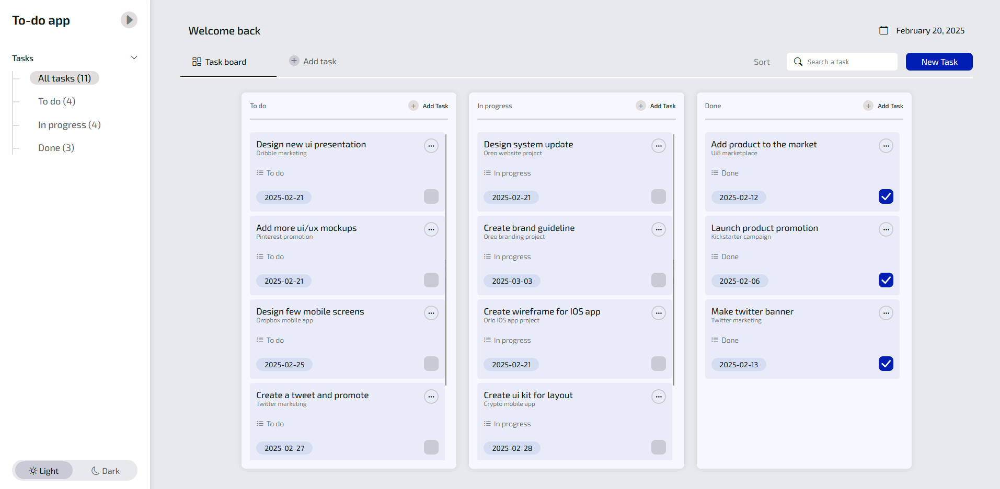

### Drag and drop (Updates status)


### Filtering and search
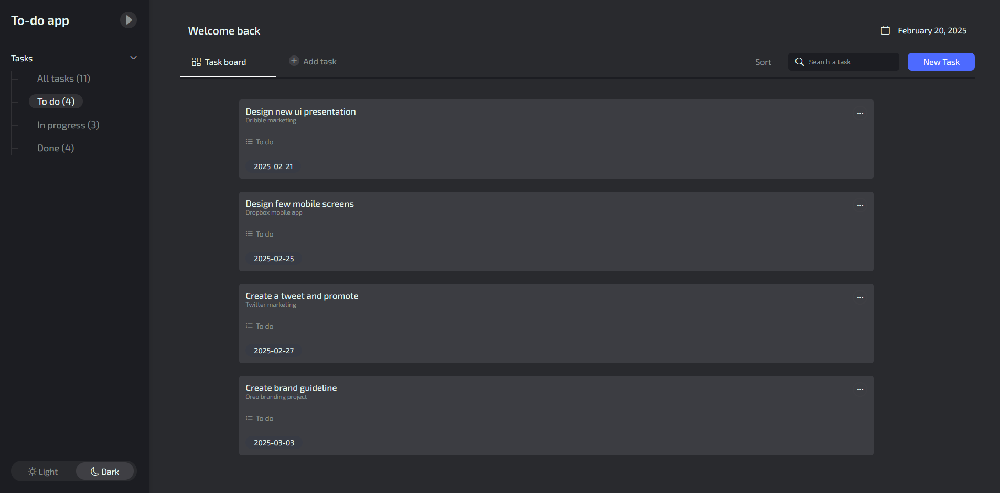
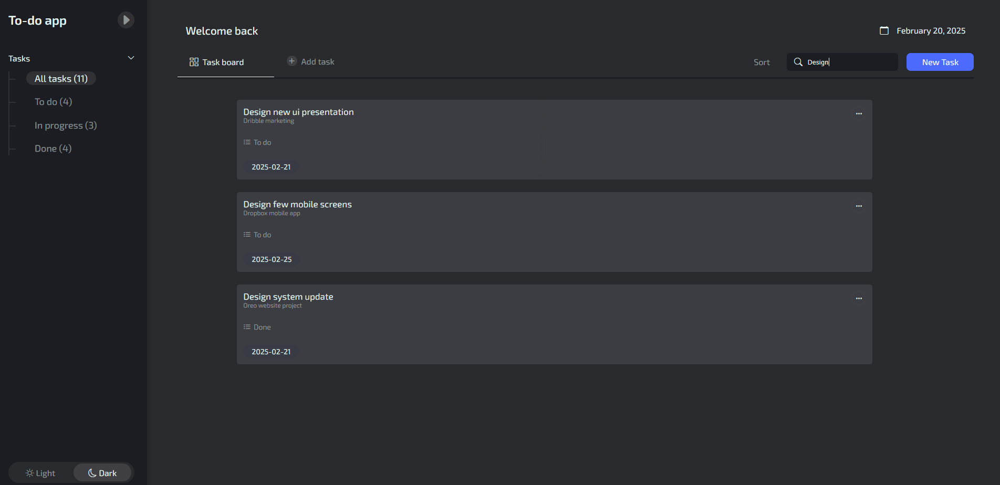

### Creation and validation, Edition and Deletion
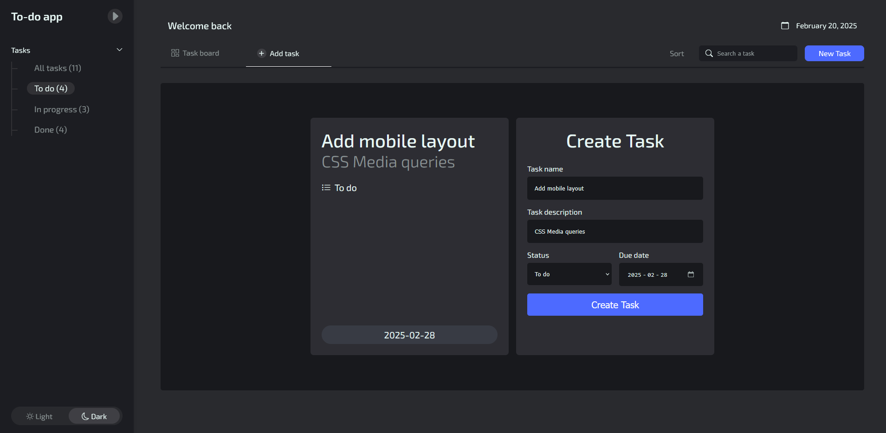
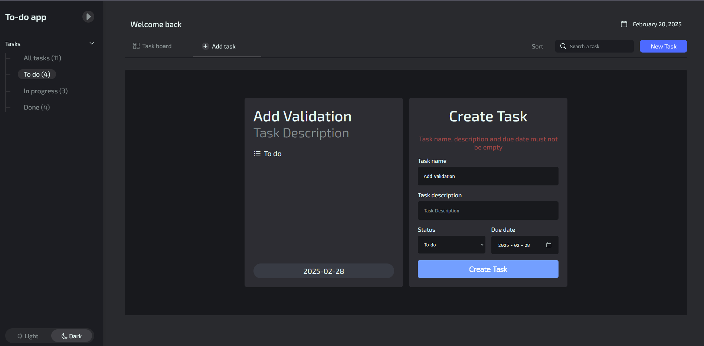
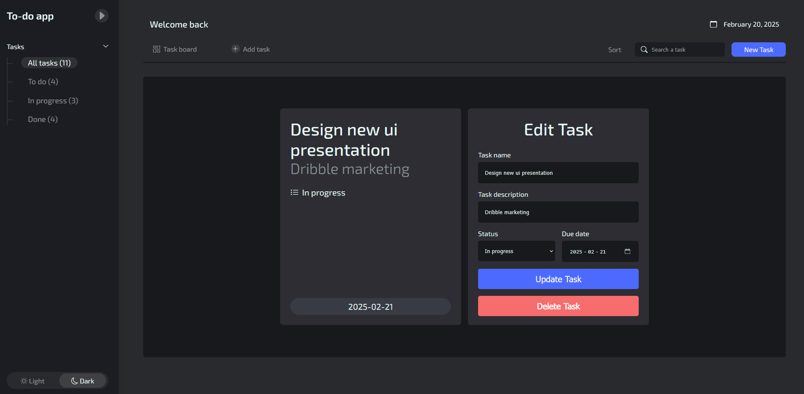

### Mobile layout
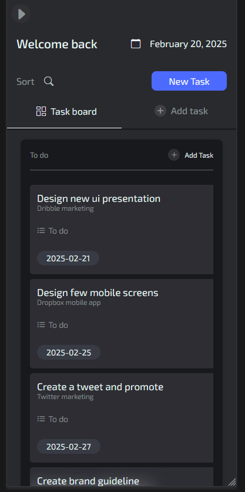
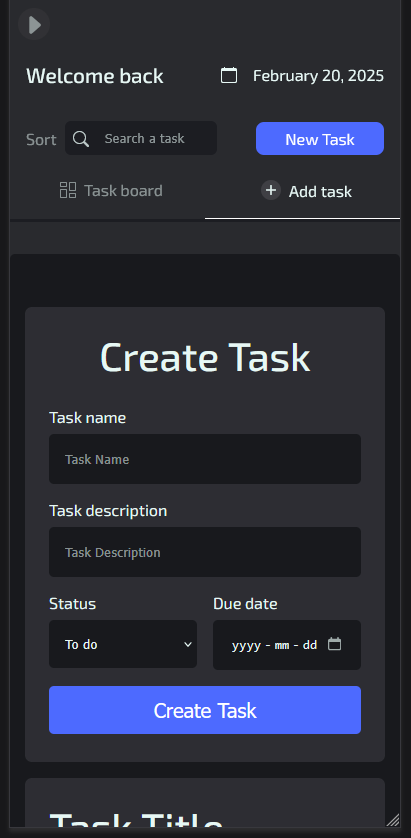
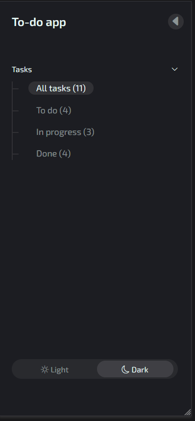
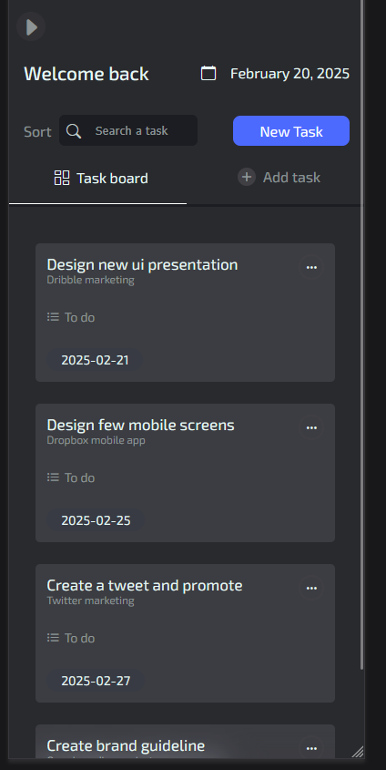


## How to Start the Project

1. **Clone the repository:**
    ```bash
    git clone https://github.com/ben4ali/To-Do-App-Ludex
    ```
2. **Navigate to the project directory:**
    ```bash
    cd my-todo-app
    ```
3. **Install dependencies:**
    ```bash
    npm install
    ```
4. **Start the development server:**
    ```bash
    npm start
    ```
5. **Open your browser and visit:**
    ```
    http://localhost:3000
    ```

## Credits
- UI mockup design inspiration from Mehdi Bagheri, https://dribbble.com/mehdibagheri
- Checkbox animation from kyle1dev on UIverse, https://uiverse.io/kyle1dev/afraid-wasp-94